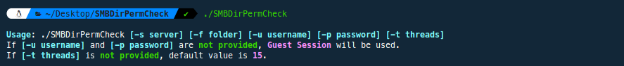
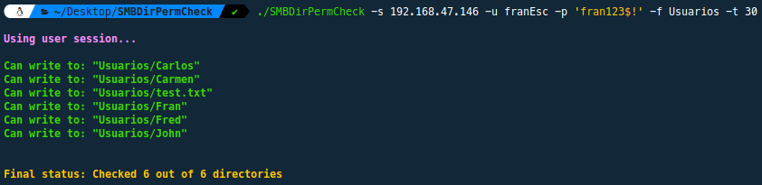
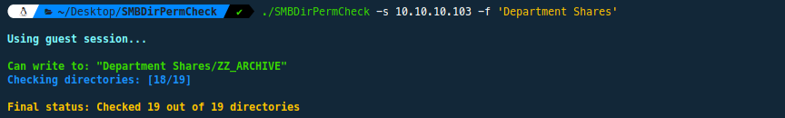

# SMB Share Permissions Tool


## Overview

**SMBDirPermCheck** is a specialized bash script, designed for security auditing and penetration testing. Leveraging *smbclient*, it provides granular permissions data for subfolders within an SMB (Server Message Block) share, a functionality often missing in standard SMB enumeration tools. 

The script operates by attempting to write a file in each resource within a shared folder, thus revealing write permissions. **SMBDirPermCheck** offers valuable insights into the security configurations of SMB shares, enabling informed decision-making in penetration testing and proactive threat mitigation scenarios.

## Features
- Retrieve detailed share permissions information for subfolders within an SMB share.
- User-friendly command-line interface for easy usage.
- Support for both guest and authenticated sessions.
- Seamless integration with other security assessment and enumeration workflows.
- Allows user-defined thread count for optimized performance.

## Installation
To use the SMB Share Permissions Tool, follow these steps:

```bash
git clone https://github.com/RipFran/SMBDirPermCheck
cd SMBDirPermCheck
chmod +x SMBDirPermCheck
```

## Usage

The script **SMBDirPermCheck** can be executed using the following command format:

```bash
./SMBDirPermCheck -s [server] -f [folder] -u [username] -p [password] -t [threads]
```

Running the tool will display the following help panel:

<p align="center">
	
</p>

Each option functions as follows:

- **Server** (*-s* parameter): This required parameter specifies the IP address or hostname of the SMB server that is to be checked.
- **Folder** (*-f* parameter): This required parameter indicates the shared resource (folder) on the SMB server for which the write permissions of its internal resources are to be scanned.
- **Username** (*-u* parameter) and **Password** (*-p* parameter): These optional parameters provide the username and password for authentication with the SMB server. If neither username nor password is provided, the script will proceed using a guest session, implying no authentication. If a username is given, a password must also be provided.
- **Threads** (*-t* parameter): This optional parameter defines the number of threads to be used for checking permissions. If this parameter is not specified, the script will use a default value of 15 threads.

Below are a couple of usage **examples**:

```bash
./SMBDirPermCheck -s 192.168.47.146 -u franEsc -p 'fran123$!' -f Usuarios -t 30
```

In this example, the script connects to the SMB server at IP address 192.168.47.146 using the username "*franEsc*" and the password "*fran123$!*". It then checks the write permissions of the internal resources within the shared resource "*Usuarios*" using 30 threads. This scenario demonstrates a typical use case with authentication.

<p align="center">
	
</p>

```bash
./SMBDirPermCheck -s 10.10.10.103 -f 'Department Shares'
```

In this second example, the script connects to the SMB server at IP address 10.10.10.103 and proceeds with a guest session, as neither a username nor a password is provided. The script then checks the write permissions of the internal resources within the shared resource "*Department Shares*" using the default number of threads (15). This scenario demonstrates a typical use case without authentication.

<p align="center">
	
</p>

These examples provide a glimpse into the functionality of the script under different conditions and settings. Depending on the situation and the permissions of the user or guest on the SMB server, the script can be used to perform a thorough check of write permissions of the internal resources within a given shared resource.

## Requirements
- Bash shell
- smbclient

## Disclaimer
This script is intended for legal use only. Use it at your own risk and only on systems that you have permission to test. The authors assume no responsibility for any misuse or damage caused by this script.

## Credits
SMBDirPermCheck was created by R1pFr4n.
